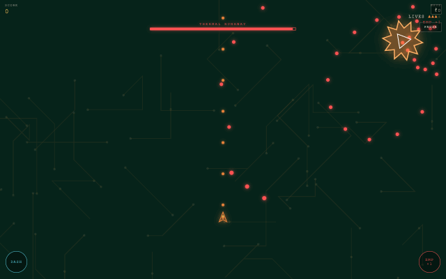
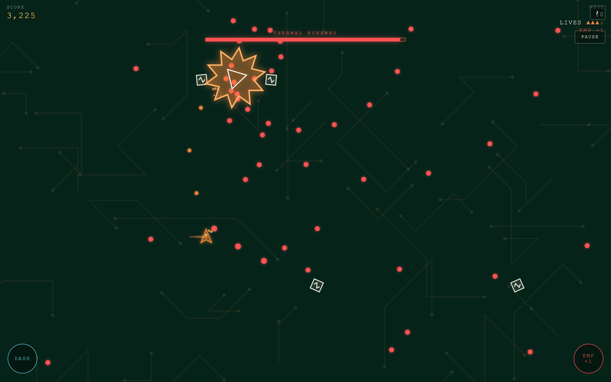
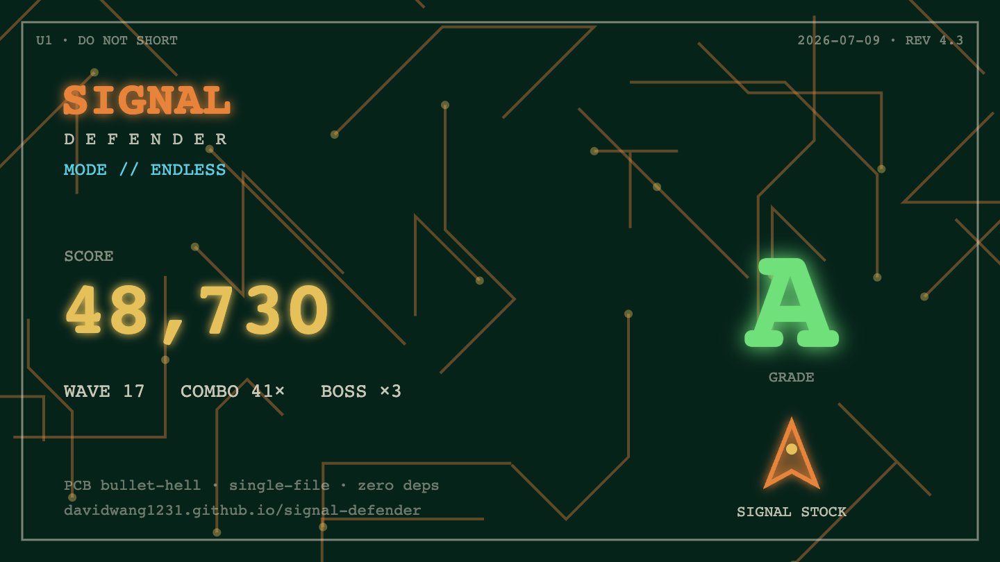
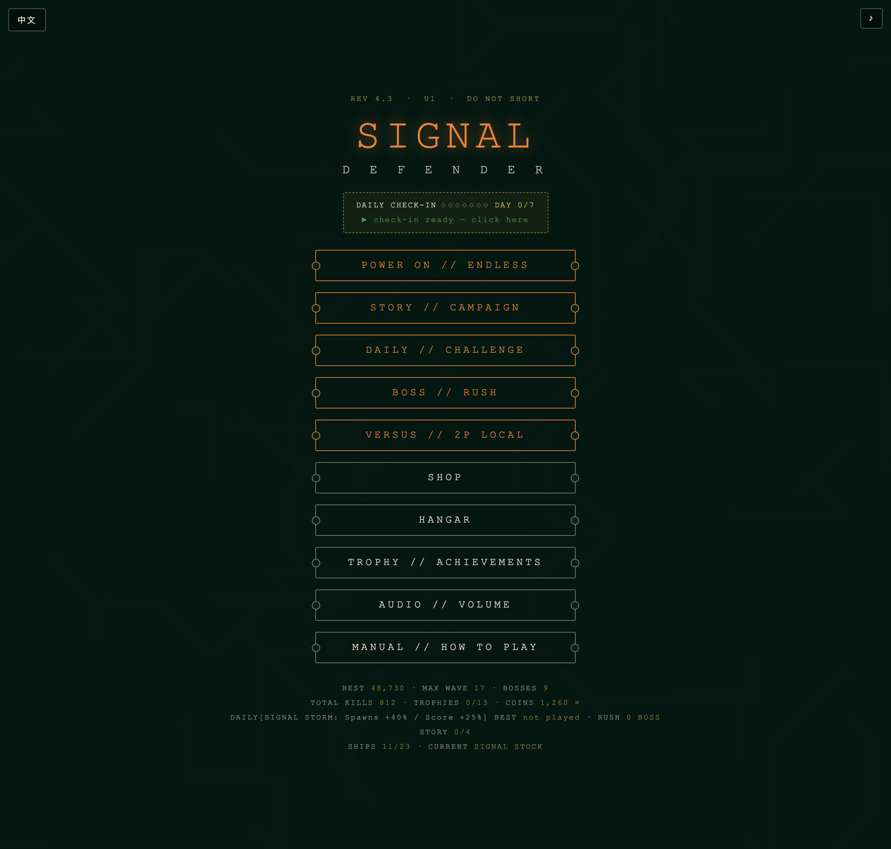
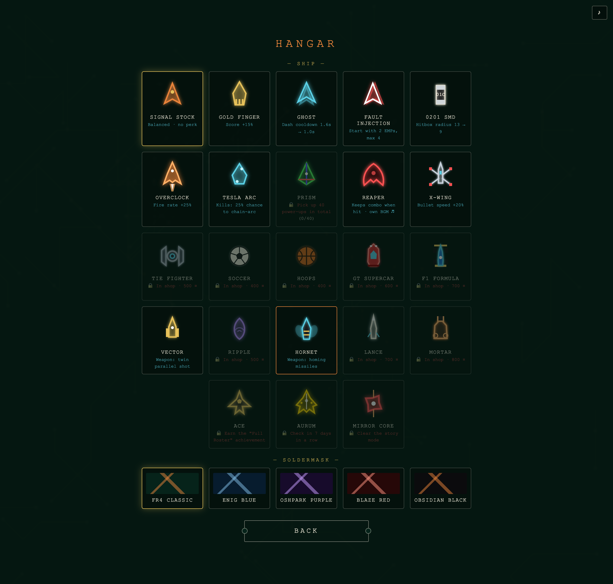

# SIGNAL // 信号防线

[](https://github.com/DavidWang1231/signal-defender/actions/workflows/check.yml)

[English](README.md) | **中文**

> 一款 PCB 电路板美学的弹幕射击游戏 —— 全部代码在一个 HTML 文件里，零依赖，双击即玩。中英双语。

**🎮 在线试玩：[https://davidwang1231.github.io/signal-defender/](https://davidwang1231.github.io/signal-defender/)**



你是主板上仅存的仲裁核心 U1。深夜，一段陌生信号沿总线蔓延，吞噬相邻的逻辑门——启动防御协议，守住这块电路板。

| Boss 战 | 分享成绩卡 |
|---|---|
|  |  |

| 主菜单 | 机库 |
|---|---|
|  |  |

## ✨ 特性

- **6 种游戏模式**：无尽模式 / 主线剧情（4 章悬疑故事）/ 每日挑战（全球统一种子 + 当日修饰词）/ Boss 连战 / 本机双人对战 / 成就收集
- **局内随机事件**：供电过载、数据雨、总线静默、磁暴——限时事件随机降临，每局体验不重样
- **23 架战机**：条件解锁、商店购买、成就奖励、连续签到四种获取途径；军械库系列每架配独特武器（追踪导弹、贯穿弹、重炮、蛇形波动弹、双管）
- **3 种 Boss 形态轮换**：短路核心（弹环+激光扫射）、热失控（螺旋弹幕）、时钟毛刺（瞬移爆发），每 5 波一战，多周目数值成长
- **金币经济**：击杀得分换金币，商店购买主题皮肤（星战/运动/跑车系列）与永久强化
- **每日签到**：独立签到页展示 7 天奖励，金币逐日递增，连续 7 天解锁隐藏战机 AURUM；上线过但忘签的日期可补签，不断连续
- **合成音频**：背景音乐与全部音效由 Web Audio API 实时合成，Boss 战自动变奏；四架高级战机（AURUM/镜像核心/收割者/棱镜）拥有专属 BGM；BGM/音效音量独立可调
- **子弹个性化**：子弹颜色跟随机身配色——棱镜发彩虹弹，AURUM 发旋转金色星形弹
- **无人机僚机**：商店购买环绕机身的协处理无人机，自动瞄准开火；高级战机可带双机
- **成绩分享卡**：一键生成 PCB 风格成绩卡图片（得分/评级/战机），保存分享
- **中英双语**：按浏览器语言自动切换，游戏内可手动切换并记住选择
- **移动端自适应**：触屏设备自动切换手机操作（单指拖动 + 双指冲刺），横竖屏自由旋转，适配刘海屏
- **擦弹系统**：敌弹贴身掠过得分，高手向操作
- **进度持久化**：localStorage 存档，皮肤/成就/金币/剧情进度自动保存

## 🕹️ 操作

| 平台 | 移动 | 冲刺（无敌帧） | EMP 炸弹 |
|---|---|---|---|
| 电脑 | WASD / 方向键 / 鼠标拖动 | Shift | B |
| 手机 | 单指拖动 | 第二根手指点按 / 左下按钮 | 右下按钮 |
| 对战 P1 | WASD | Q | E |
| 对战 P2 | 方向键 | Shift | Enter |

`空格` / `P` 暂停 · 自动开火 · 右上角 ♪ 开关音乐 · 左上角切换语言

> 鼠标拖动响应极快，适合追求极限走位；键盘固定速度，更稳更精准——按喜好选择操控方式。

## 🚀 本地运行

不需要构建、不需要安装：

```bash
# 方式一:直接用浏览器打开
open index.html

# 方式二:起个本地服务器(手机同 Wi-Fi 可访问)
python3 -m http.server 8000
```

## ✅ 自检

没有测试框架 —— 弹幕游戏的回归是手感和画面，单元测试抓不到。取而代之的是一个零依赖脚本，只守四条**真会把游戏推坏**的不变量，CI 每次 push 都跑：

```bash
node scripts/check.mjs   # 只需要 node，没有任何依赖
```

- **syntax** —— 内联 `<script>` 必须能解析。单文件无构建，语法错误会直接推上 Pages 变白屏。
- **version** —— `REV x.y` 散在四处，必须一致。
- **i18n** —— 静态中文必须带 `data-en`，否则英文模式会漏出中文。
- **zero-deps** —— 禁止外链 `<script src>`、`<link href>`、`@import` 和运行时 `fetch`。一条 CDN 字体就让它离线打不开。

## 🛠️ 技术

- 单文件 HTML + 原生 JavaScript，无任何框架和外部资源（约 120 KB）
- Canvas 2D 渲染：全部飞船 / Boss / 特效均为程序化绘制，无图片素材
- Web Audio API：振荡器合成音效 + 程序化循环 BGM（独立增益节点分路控制）
- 每日挑战使用 mulberry32 种子随机数，同一天全球玩家面对相同的敌潮序列
- i18n 采用极简 `T(zh, en)` 辅助函数 + `data-en` 属性方案，语言在渲染前确定

## 📄 License

[MIT](LICENSE)
